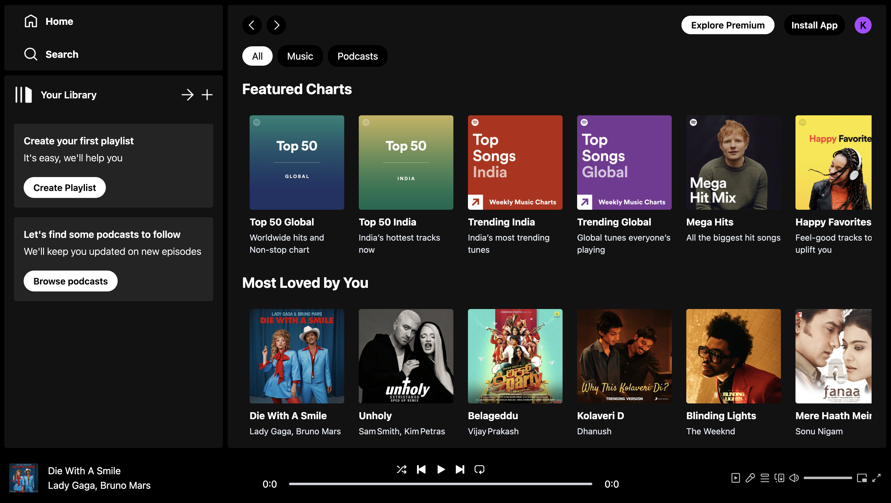
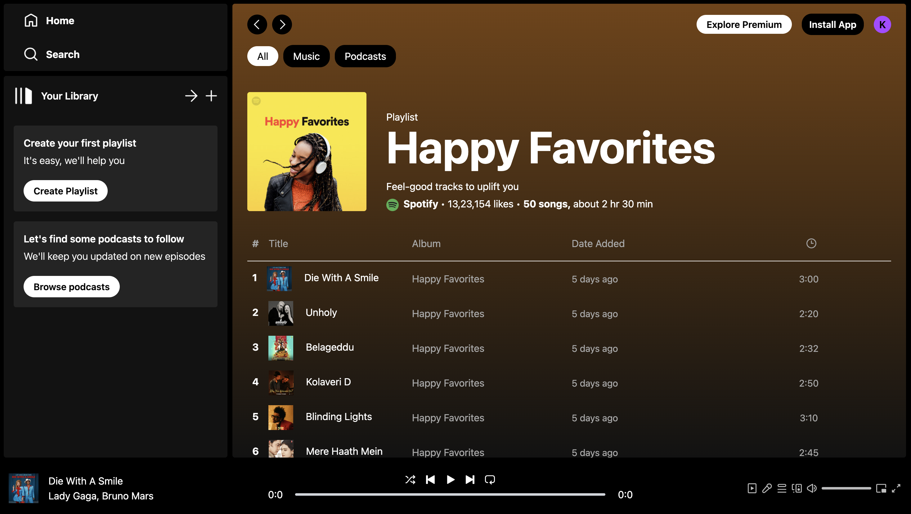
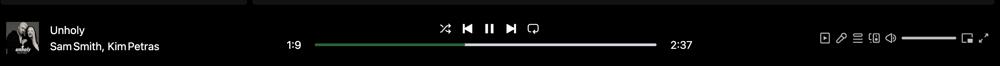

# 🎵 Spotify Clone Web App

Welcome to the **Spotify Clone** project — a responsive and sleek music streaming interface inspired by Spotify, built using modern frontend technologies. This project showcases a well-structured layout, music controls, dynamic routing, and a fully functional UI for music albums.

🔗 Live Demo
------------
👉 View Live App: 

## 📸 Screenshots & Visuals

- 🎵 **Home Screen** with recommended and featured albums



- 📀 **Album View** with tracklist and dynamic background color



- ▶️ **Player Controls** at bottom with real-time updates



## 📁 Folder Structure

```
spotify-clone/
│
├── public/                 # Public assets and the main index.html file
│
├── src/                    # All React source code
│   ├── assets/             # Contains images, icons, and music data
│   ├── components/         # Reusable components like Navbar, Sidebar, Player
│   ├── pages/              # Core display pages like Display.jsx and DisplayAlbum.jsx
│   ├── context/            # React Context (PlayerContext.jsx) to handle state and control logic
│   ├── App.jsx             # Main app component
│   ├── main.jsx            # React entry point
│
├── .gitignore              # Git ignore file
├── package.json            # Project metadata and dependencies
└── README.md               # Project documentation
```

## 🚀 Features

- 🎨 Modern UI with Tailwind CSS
- 🔀 Dynamic Routing using React Router (`/` and `/album/:id`)
- 🎧 Music playback controls (Play, Pause, Next, Previous)
- 🔊 Seekbar with live time update
- 🎚️ Context API usage for global player state
- 🎯 Fully responsive layout (desktop & mobile)
- 📦 Organized and modular file structure

## 🧠 Technologies Used

- **React JS** 🧩
- **Tailwind CSS** 🎨
- **React Router DOM** 🌐
- **React Context API** 🧠
- **JavaScript ES6+** 🚀

## 📂 Key Components Breakdown

### `Display.jsx`
- Controls main screen logic using routing.
- Uses `<Routes>` to render `DisplayHome` or `DisplayAlbum`.

### `DisplayAlbum.jsx`
- Dynamically renders album details.
- Pulls album data from `useParams()` and changes background using `useRef`.

### `PlayerContext.jsx`
- Holds the global state for music controls.
- Contains logic for play, pause, previous, next, and seeking audio.

### `App.jsx` & `main.jsx`
- Wraps everything inside `PlayerContextProvider`.
- Bootstraps the React application using `createRoot()`.

## 💡 How Routing Works

- `/` → Shows homepage albums (`DisplayHome`).
- `/album/:id` → Renders album details using dynamic ID (`DisplayAlbum`).

> The transition is handled using `useNavigate()` and `<Link>` or `onClick` events that navigate the user programmatically.

## 🔧 Setup Instructions

1. Clone the repo:
```bash
git clone https://github.com/your-username/spotify-clone.git
cd spotify-clone
```

2. Install dependencies:
```bash
npm install
```

3. Start the development server:
```bash
npm run dev
```

## 🤝 Acknowledgements

- Inspired by the official Spotify interface.
- UI reference and logic guidance taken from GreatStack YouTube tutorials and React documentation.

## 📬 Contact

If you have questions, feel free to open an issue or reach out.

---

🧑‍💻 *Built with ❤️ by Kushal*